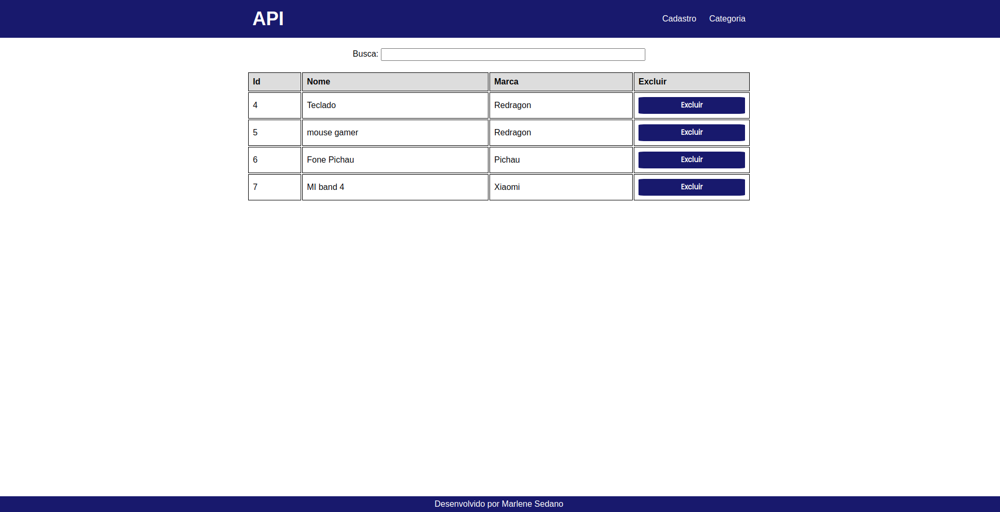
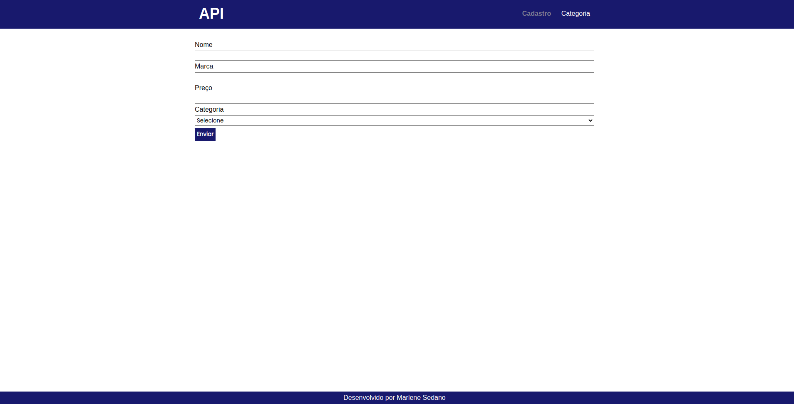
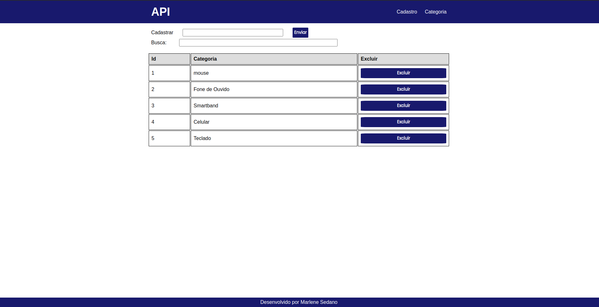

# Consumo de API

Projeto de consumo de API onde é possivel cadastrar produtos e categorias e filtrar-los, ultilizando Json-Server.

## Projeto Consumo de API com Json Server


### Tecnologias

Este projeto foi desenvolvido com as seguintes tecnologias:

- HTML
- Css
- JavaScript
- Json-Server

                                                     
## Demonstração
 

Nesta tela mostra o inicio do projeto, onde é possivel filtrar os produtos por Nome e caso queira excluir, o processo de excluir vai excluir tanto da DOM quanto do Banco de Dados (Json-server).



Ao selecionar a guia Cadastro que se encontra no header, é possivel cadastrar o produto. Basta preencher os campos e selecionar a categoria desejada, caso não tenha a categoria é possivel cadastrar na guia Categoria.

 
Na tela abaixo é a tela de Categorias, onde é possivel também realizar a busca por nome e também é possivel realizar o cadastro.



## Como usar

```
Para usar tem que baixar o pacote do Json no seguinte caminho: https://github.com/typicode/json-server.

Ao dar o start no serviço, usar o banco de dados bd.json que esta também anexado no repositório. (vai mostrar um banco de dados ja com alguns produtos e categorias).

Para dar start no serviço ultilzar o comando: json-server --watch bd.json 


E o repositório esta no seguinte caminho:

# Clone este repositório
$ git clone https://github.com/marlenesedano/cadastro_produto_jsonserver.git


